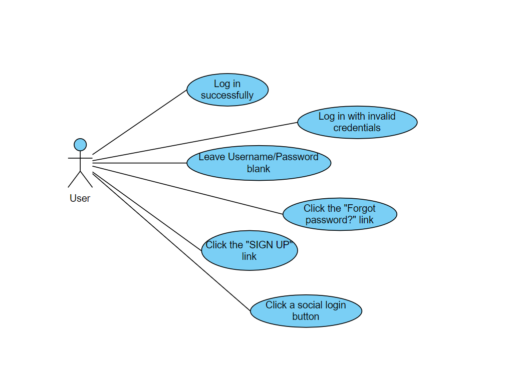

# Lab03 – Selenium Login Test

## Sơ đồ Use Case


## Danh sách test case

1. **Đăng nhập thành công** – `login_success.py`
2. **Đăng nhập trống username/password** – `login_empty.py`
3. **Sai mật khẩu** – `login_wrong_password.py`
4. **Link Forgot password?** – `forgot_password.py`
5. **Link SIGN UP** – `signup_link.py`
6. **Kiểm tra social login buttons** – `social_buttons.py`

## Cách chạy test

Yêu cầu:
- Python 3.13
- Selenium: `pip install selenium`
- ChromeDriver tương thích Chrome

Chạy từng test trong terminal:
```bash
python login_success.py
python login_empty.py
python login_wrong_password.py
python forgot_password.py
python signup_link.py
python social_buttons.py
